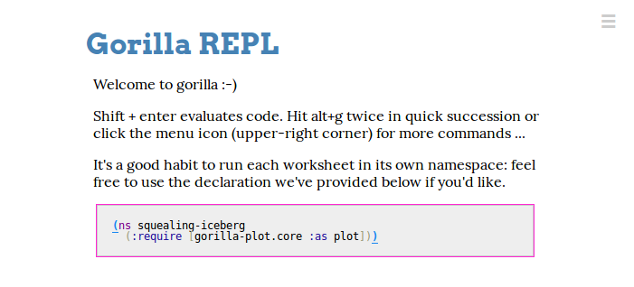
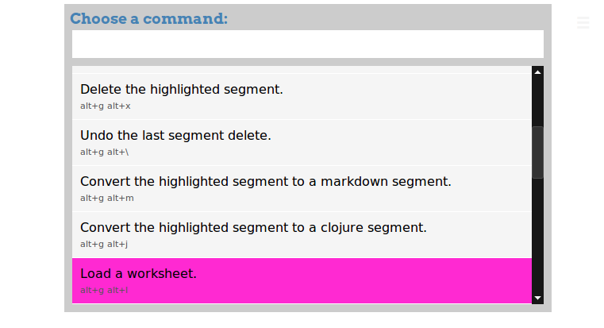
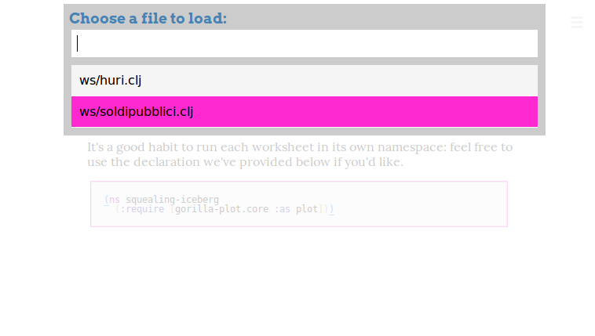
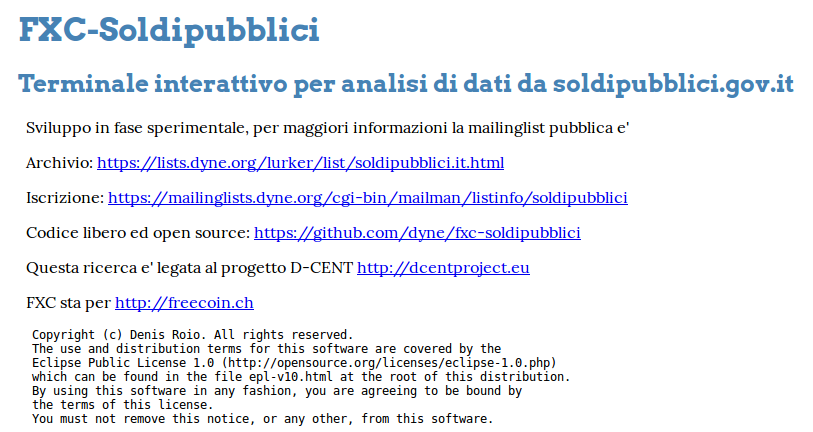
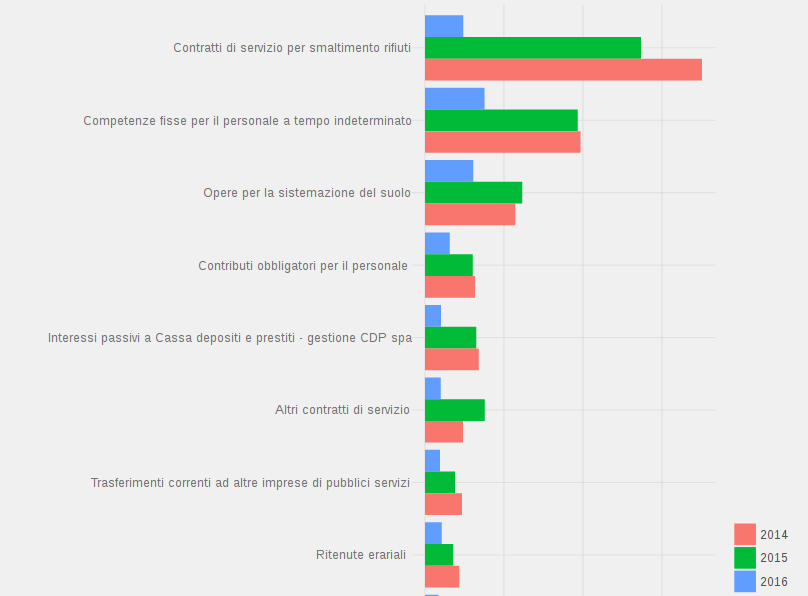

# FXC-Soldipubblici

Una console interattiva in Clojure che fornisce un terminale per
l'analisi dei dati pubblicati dal Governo Italiano tramite progetto [SIOPE](https://www.siope.it) e [soldipubblici.gov.it](http://soldipubblici.gov.it).

[](http://www.dyne.org)

## Requisiti

Questo applicativo e' multi-piattaforma. Il funzionamento e' solo
assicurato se fatto girare su GNU/Linux, ma e' possibile utilizzarlo
sia su Mac/OSX che MS/Windows.

I requisiti software da istallare sono:

 - OpenJDK http://openjdk.java.net
 - Leiningen e Clojure http://leiningen.org
 - R https://www.r-project.org
 - un browser qualsiasi che supporti JS e SVG
 
Dentro la console R per l'analisi statistica istallare i seguenti pacchetti:

```
install.packages("ggplot2")
install.packages("scales")
install.packages("grid")
install.packages("RColorBrewer")
install.packages("ggrepel")
install.packages("svglite")
```
 
## Utilizzo

Una volta istallato tutto aprire un terminale nella cartella di
fxc-soldipubblici e lanciare il comando: `lein gorilla`. Dopo un po'
il comando restituira' informazioni su un indirizzo web in
locale, per esempio:

```
Gorilla-REPL: 0.3.6
Started nREPL server on port 49187
Running at http://127.0.0.1:39426/worksheet.html .
Ctrl+C to exit.
```

A questo punto si deve copiare l'indirizzo
`http://127.0.0.1:39426/worksheet.html` (notare: la porta cambia ogni
volta) ed aprirlo con il browser.

Una volta fatto cio' ci si trovera' in questa schermata.



A questo punto premendo il pulsante per menu in alto a destra o usando
la combo `alt+g alt+l` occorre caricare il "worksheet" di
soldipubblici



che apparira' tra i files come selezione:
`ws/soldipubblici.clj`



A questo punto ci si trova nel terminale interattivo per "livecoding"
cioe' per sperimentare in tempo reale con codice e dati e
visualizzazione. Un messaggio di benvenuto fornisce un po' di link che
pero' sono solo clickabili con tasto destro




Il linguaggio usato e' Clojure che e' un dialetto del
LISP molto efficiente che offre anche varie estensioni per facilitare
la manipolazione di larghe basi dati. E' molto potente anche se ancora
poco conosciuto, in Dyne.org riusciamo a fare grandi cose con questo
linguaggio ;^)

```clojure
(ns fxc-soldipubblici.core
  (:require
   [clojure.string :as string]
   [clojure.data.json :as json]
   [clojure.contrib.humanize :refer :all]
   [fxc-soldipubblici.core :refer :all :reload :true])
  (:use [gorilla-repl core table latex html]
        [huri core plot etl]
        ))

(table-view (cerca-enti "PESCARA")
            :columns [:codice 'creazione 'scadenza "???"
			          :nome "??" "??" 'popolazione :tipo])

(def dati (raccogli-dati "PRO" "000016324" "Pescara"))

(bar-chart :desc
           [:2016 :2015 :2014] {:flip? true :height 12}
           (where {:2016 [> 10000000]}
                  (analizza-dati dati)))
```

Il codice iniziale riportato qui sopra usa `cerca-enti` per visualizzare una lista di enti che contengono la stringa "PESCARA", poi contatta il
portale soldipubblici.gov.it importando tutte le voci di spesa.
Di seguito usando i comandi `bar-chart` e `analizza-dati` e' possibile visualizzare un grafico ordinato delle voci di spesa maggiori.

Per procedere ed eseguire ogni blocco di codice premere
`shift+invio`. Tornando indietro e' posibile cambiare il codice e
rieseguirlo.

I quadri offrono esempi di manipolazione dei dati. Questo approccio e' estremamente flessibile e permette anche di salvare lo storico delle manipolazioni avvenute sui dati, permettendone quindi una verifica.



E' possibile fare molto di piu' ed in un futuro prossimo ci
ripromettiamo di continuare lo sviluppo. Contributi benvenuti
sulla pagina https://github.com/dyne/fxc-soldipubblici

Per chiedere aiuto e conoscere altri utenti e' possibile iscriversi con la propria email alla [mailinglist soldipubblici](https://mailinglists.dyne.org/cgi-bin/mailman/listinfo/soldipubblici).

## Licenza

Copyright © 2016 fondazione Dyne.org, Amsterdam

Programma ideato, scritto e mantenuto da [@jaromil](https://twitter.com/jaromil)

Ringraziamenti in particolare a [Rich Hickey](https://twitter.com/richhickey) per Clojure, [Jony Hudson](http://j-star.org) per Gorilla e [Simon Belak](https://twitter.com/sbelak) per Huri, brillanti sviluppatori il cui lavoro non smette mai di ispirarmi e motivarmi. 

FXC-Soldipubblici non sarebbe mai esistito senza la piu' ampia ricerca su nuove tecnologie per la democrazia digitale svolta in seno al progetto [D-CENT](http://dcentproject.eu).

FXC-Soldipubblici e' distribuito secondo la Eclipse Public License (come Clojure) in versione 1.0 o (a libera discrezione) qualsiasi versione successiva della licenza.

